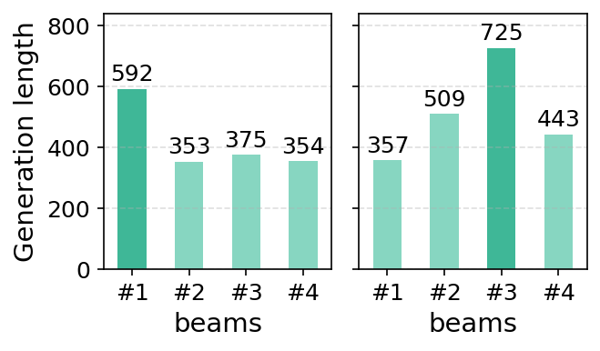
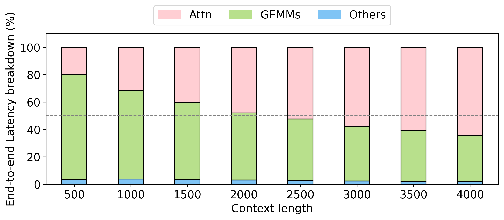
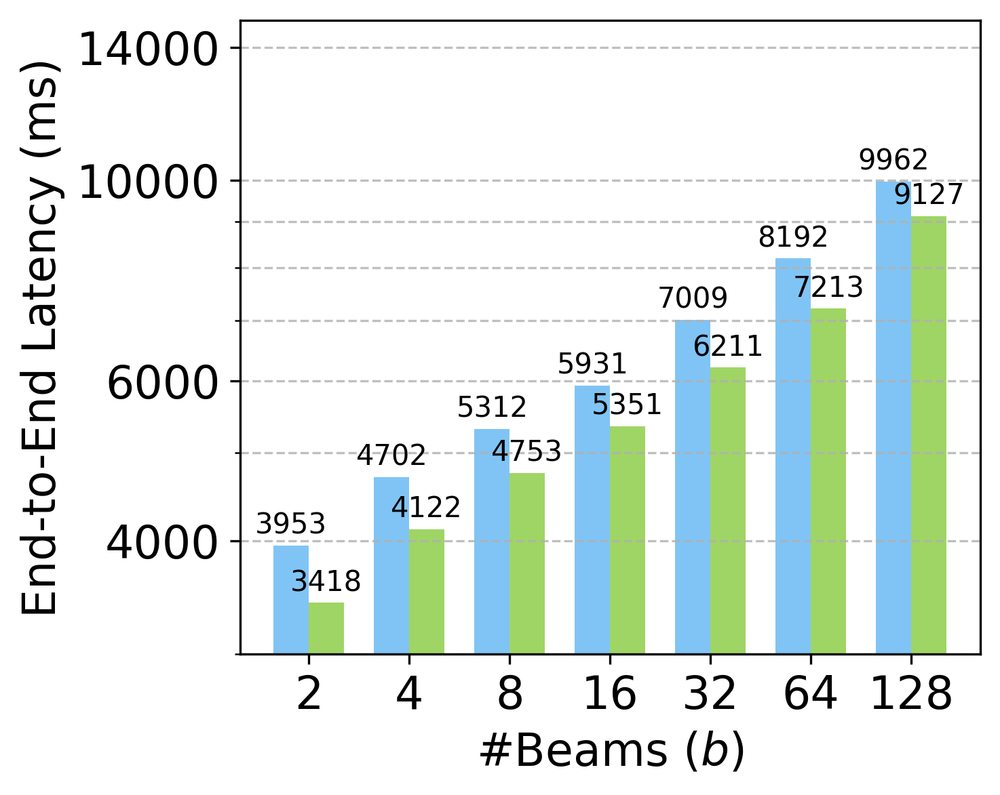
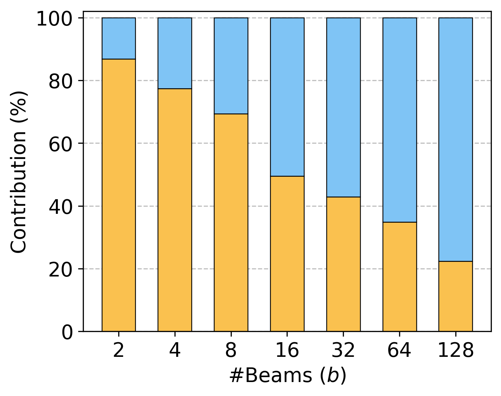

# AccTTS

Anonymous artifact for **AccTTS: Bottleneck Analysis and Computational Optimization of Test-Time Scaling for Edge Deployment**.

AccTTS is an adaptive computational optimization framework for test-time scaling (TTS) decoding. It targets the changing compute pattern of TTS workloads, where decoding moves from many-beam, short-context execution to few-beam, long-context execution. AccTTS accelerates this process without changing the underlying TTS algorithm.

## Overview

TTS improves reasoning quality by spending more inference-time compute rather than increasing model size. This makes it attractive for memory-constrained edge deployment, but it also exposes two hardware bottlenecks:

- **Small-beam GEMM inefficiency:** as beams finish, GEMM shapes become skinny and general-purpose kernels waste work on padded rows.
- **Low attention parallelism:** in the few-beam, long-context regime, attention kernels expose fewer thread blocks and underutilize the GPU.

AccTTS addresses these bottlenecks with:

- **Beam-aware GEMM selection:** offline profiling selects efficient GEMM kernels for beam-dependent shapes, and runtime execution dispatches kernels according to the current number of alive beams.
- **Profiling-based attention chunk splitting:** offline profiling builds a lookup table over beam counts and context lengths, and runtime execution chooses when and how to split attention contexts.

Integrated with a vLLM-based TTS pipeline, AccTTS achieves **1.08x to 1.43x end-to-end speedup** across MATH-500, AIME, Qwen-2.5-1.5B-Instruct, Llama-3.2-1B-Instruct, Best-of-N, and beam search.

## Figures

Selected figures from the paper are included under [`figures/`](figures/).

| Compute Pattern | Bottleneck Analysis |
| :---: | :---: |
|  |  |

| End-to-End Results | Kernel Contributions |
| :---: | :---: |
|  |  |

Additional processed profiling artifacts are provided in [`nvidia_toolkit_data/`](nvidia_toolkit_data/). Raw Nsight reports and local model/data caches are intentionally excluded from the anonymous repository.

## Repository Structure

```text
.
├── agent_markdown/          # Experiment notes and sweep logs
├── figures/                 # Paper figures
├── nvidia_toolkit_data/     # Processed profiling CSV/XLSX data and notebooks
├── recipes/                 # YAML configs for TTS algorithms and models
├── scripts/                 # Profiling, tracing, replay, and plotting scripts
├── src/sal/                 # TTS pipeline and AccTTS-related runtime code
└── tests/                   # Minimal tests
```

This codebase extends a search-and-learn style TTS pipeline with AccTTS-specific tracing, replay, GEMM profiling, attention profiling, and runtime optimization support.

## Installation

Create a Python environment:

```bash
conda create -n acctts python=3.11
conda activate acctts
```

Install the repository:

```bash
pip install -e .
```

For development utilities:

```bash
pip install -e '.[dev]'
```

You will also need a CUDA-capable PyTorch/vLLM/Triton stack compatible with your GPU. Some model or dataset accesses may require Hugging Face login:

```bash
huggingface-cli login
```

## Quick Start

Run a small Best-of-N example:

```bash
python scripts/test_time_compute.py recipes/Qwen2.5-1.5B-Instruct/best_of_n.yaml \
  --num_samples=2 \
  --n=4
```

Run a small beam-search example:

```bash
python scripts/test_time_compute.py recipes/Qwen2.5-1.5B-Instruct/beam_search.yaml \
  --num_samples=2 \
  --n=4
```

Outputs are written under `data/` by default. The `data/` directory is ignored by Git because full experiment outputs and model caches can be large.

## Reproducing Paper-Style Experiments

The paper uses replay-based evaluation so that different kernels execute the same recorded workload. The main workflow is:

1. Collect token-length traces for a TTS setting.
2. Replay the recorded workload with the baseline or AccTTS kernels.
3. Aggregate latency and accuracy metrics.
4. Regenerate plots from the notebooks in `scripts/` and `nvidia_toolkit_data/`.

Useful entry points include:

- [`scripts/run_aime_sweep.sh`](scripts/run_aime_sweep.sh)
- [`scripts/run_qwen3b_sweep.sh`](scripts/run_qwen3b_sweep.sh)
- [`scripts/run_llama1b_sweep.sh`](scripts/run_llama1b_sweep.sh)
- [`scripts/beam_search_task_trace.py`](scripts/beam_search_task_trace.py)
- [`scripts/best_of_n_task_trace.py`](scripts/best_of_n_task_trace.py)
- [`scripts/gemm_best_templates_collect.py`](scripts/gemm_best_templates_collect.py)
- [`scripts/chunk_setting_profile.py`](scripts/chunk_setting_profile.py)

The experiment notes in [`agent_markdown/`](agent_markdown/) document the sweep order and expected artifacts.

## Main Configurations

Representative configs are available for:

- Qwen-2.5-1.5B-Instruct
- Llama-3.2-1B-Instruct
- Llama-3.2-3B-Instruct
- AceMath-7B-Instruct

Each model folder under [`recipes/`](recipes/) contains Best-of-N, beam search, and DVTS configs. The shared configs [`recipes/best-of-n.yaml`](recipes/best-of-n.yaml) and [`recipes/beam-search.yaml`](recipes/beam-search.yaml) are used by several sweep scripts.

## Notes for Anonymous Review

- The repository contains source code, configs, processed profiling data, and paper figures.
- Raw local logs, Hugging Face caches, model blobs, generated experiment outputs, and Nsight binary reports are excluded.
- The submitted PDF is not required to run the code and is not included in this repository.

## Citation

This repository accompanies an anonymous EMNLP 2026 submission. Citation information will be added after the review process.
